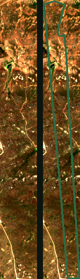

# Sentinela Rural

**A ponte no WhatsApp entre o órgão ambiental e o produtor rural.** O satélite preenche o que falta no
CAR, traduz a pendência em linguagem rural e gera o pacote pronto para o módulo oficial do SICAR.

> 🇧🇷 haCARthon · **Desafio 1** · Cadastro Ambiental Rural como Bem Público Digital.
> Apoio à **regularização do produtor** — o **aceite é dele**, no módulo oficial. Não recriamos o SICAR.

Este repositório é o **núcleo aberto** da solução: o método, o código e a documentação, **reproduzíveis a
partir de dados públicos**. Roda o fluxo completo **para um CAR** — sem nenhuma chave nossa.

> 🇬🇧 **In one line:** the WhatsApp bridge between the environmental agency and the small farmer —
> satellite fills the gaps in the rural land registry (CAR), translates the issue into plain rural
> language, and generates an **importable package** for the official system. Runs end-to-end on
> **one property** from **public data only** — no key of ours, no Earth Engine. The farmer accepts.

---

## O problema

O CAR é a principal ferramenta de gestão ambiental do país, mas só protege quando está **correto e
validado** — e o gargalo é o produtor:

- **~6,5 milhões** de cadastros aguardam análise, muitos com só o perímetro (≈60% não têm parcela no SIGEF) e sem as camadas ambientais;
- **920.571** já foram analisados e estão congelados esperando o produtor responder a uma notificação que ele não leu.

A causa é a mesma: o pequeno produtor (93,6% da base), digitalmente excluído, recebe tudo em linguagem
técnica num portal que não acessa.

## A solução (o loop)

1. **Órgão dispara** — a analista (ou a própria análise) seleciona o caso e manda o recado.
2. **Satélite + tradução** — o motor lê o imóvel por satélite, monta o *antes/depois* e traduz a pendência: o que corrigir, como, até quando.
3. **WhatsApp** — o produtor confirma o que o satélite achou (não desenha nada).
4. **Hand-off oficial** — o sistema gera um **KML/.CAR importável** → o produtor importa no módulo oficial → envia no SICAR. **Não recriamos o SICAR; o aceite é dele.**

## ⚡ Reproduza num CAR — sem login, sem licença (já vem um exemplo)

```bash
pip install -r requirements.txt
python examples/run_one_car.py examples/car.geojson Caatinga
```

`examples/car.geojson` é um **perímetro público real** (PB, Caatinga, ~126 ha) — troque pela geometria de
qualquer CAR (baixe na [consulta pública do SICAR](https://consultapublica.car.gov.br/publico/imoveis/index)).
O script: baixa o **RGB Sentinel-2** do AWS Open Data (sem GEE, sem login), lê o **MapBiomas** do bucket
público, busca a **hidrografia no OpenStreetMap** para a APP, aplica as regras (APP por buffer de rio,
Reserva Legal por bioma, consolidada pré-2008), renderiza o *antes/depois* e exporta o **KML importável**.
O envio no WhatsApp (`sentinela/whatsapp.py`) usa a Meta Cloud API com a **sua própria** chave.



> 🇬🇧 **No database, no key.** Bring any property polygon and the full loop runs on public data
> (Sentinel-2 + MapBiomas + OpenStreetMap hydrography), ending in an importable KML for the official system.

### Camada distinta: SIGEF / SNCR — regularização (pública, sem CPF)

O CAR é ambiental; a regularização fundiária passa pelo **georreferenciamento certificado (SIGEF)** e pelo
cadastro rural (SNCR/CCIR). Responda — **sem nenhum dado de pessoa** — se o perímetro coincide com uma
**parcela certificada no SIGEF** e quantos **módulos fiscais** tem. As parcelas do SIGEF são **públicas**
([Acervo Fundiário do INCRA](https://acervofundiario.incra.gov.br/)); você baixa e traz a camada:

```bash
python examples/run_one_car.py examples/car.geojson Caatinga \
       --sigef parcelas_sigef_incra.geojson
# → "sigef": { "certificado_sigef": true, "sobreposicao_pct": 42.8, "n_parcelas": 1 }   (sem titular/CPF)
```

Saída deliberadamente **mínima e sem identidade**: o cruzamento por titular/CPF é sigilo e fica **de fora**
(open-core). `examples/parcelas_sigef_exemplo.geojson` é só ilustrativo — baixe as parcelas reais no INCRA.

## Modelo open-core

> **O núcleo é aberto e reproduzível num CAR.** A **base nacional já consolidada** (8,4M CAR, 9 camadas,
> 27 estados em PostGIS) e a **operação concorrente** sobre milhões de cadastros são o **serviço da
> equipe** — anos de trabalho sobre dados públicos, não um requisito fechado nem um algoritmo secreto.

Em uma frase: **o método publicamos; a base montada e a operação, não.** Qualquer um roda num CAR;
rodar nos 8,4 milhões em produção é o serviço.

## Stack — 100% aberto, sem cativeiro

| Camada | O que usamos |
|---|---|
| Imagem de satélite | **Sentinel-2 L2A** via AWS Open Data (`earth-search.aws.element84.com`) — sem GEE, sem login |
| Uso e cobertura do solo | **MapBiomas** (COG público na Google Cloud Storage, download direto) |
| Hidrografia / limites | IBGE, ANA (shapefiles públicos) |
| Cadastro fundiário | SNCR, SIGEF, **SICAR consulta pública** |
| Geoprocessamento | PostGIS · GDAL/`ogr2ogr` · shapely · rasterio |
| Base / mapas | OpenStreetMap |

**Nada de Google Earth Engine. Nada de ArcGIS pago.** É a premissa de Bem Público Digital do edital.

## Estrutura

```
sentinela/
  sentinel.py     # RGB Sentinel-2 do AWS Open Data (sem GEE)
  mapbiomas.py    # leitura do COG do MapBiomas (sem GEE)
  rivers.py       # hidrografia pública (OpenStreetMap) para a APP — sem base nossa
  diagnose.py     # regras: APP (buffer do rio), Reserva Legal (por bioma), consolidada pré-2008
  sigef.py        # ★ SIGEF/SNCR: certificação + módulo fiscal (público, sem CPF) — camada distinta
  overlay.py      # imagem antes/depois
  export_kml.py   # pacote KML/.CAR importável no módulo oficial
  whatsapp.py     # envio via Meta Cloud API + fluxo de conversa de referência
examples/
  run_one_car.py            # roda o fluxo completo num CAR público (+ --sigef)
  car.geojson               # perímetro público real de exemplo (PB, Caatinga)
  parcelas_sigef_exemplo.geojson   # ilustrativo (baixe o real no INCRA)
  saida_antes_depois.png    # saída de exemplo (não precisa rodar p/ ver)
  saida_CAR_retificacao.kml
docs/                      # arquitetura e metodologia
```

## Licença

[MIT](LICENSE) — use, adapte e redistribua. Contribuições e adaptações por outros estados/países são bem-vindas.
